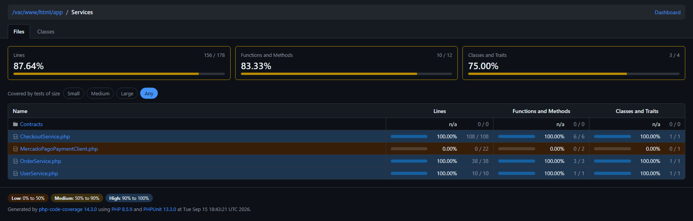

# Checkout com Mercado Pago

Checkout de e-commerce em Laravel + Livewire, integrado ao Mercado Pago com três meios de pagamento: **cartão de crédito**, **Pix** e **boleto**.

O fluxo é um componente Livewire de página inteira, dividido em três etapas (informações → frete → pagamento), com tokenização do cartão no browser pelo SDK do Mercado Pago, confirmação por e-mail assíncrona e página de resultado protegida por URL assinada.

## Stack

| Camada | Tecnologia |
|---|---|
| Framework | Laravel 13 · PHP 8.5 |
| Front-end | Livewire 3 · Alpine · Tailwind · Vite |
| Pagamentos | `mercadopago/dx-php` 3 (server) · `@mercadopago/sdk-js` (browser) |
| Banco | MySQL 8 |
| Fila / e-mail | Redis · Mailpit (desenvolvimento) |
| Testes | Pest 5 · `pest-plugin-laravel` |
| Ambiente | Laravel Sail (Docker) |

## Como rodar

```bash
git clone <repo> && cd checkout-pagamento-mercado-pago
cp .env.example .env
composer install
./vendor/bin/sail up -d
./vendor/bin/sail artisan key:generate
./vendor/bin/sail artisan migrate --seed
./vendor/bin/sail npm install && ./vendor/bin/sail npm run dev
```

### Atalho para o Sail

Todos os comandos deste README começam com `./vendor/bin/sail`. Vale criar um alias e escrever só `sail`:

```bash
alias sail='sh $([ -f sail ] && echo sail || echo vendor/bin/sail)'
```

Para não perder o atalho ao fechar o terminal, acrescente a linha ao seu `~/.bashrc` (ou `~/.zshrc`) e recarregue:

```bash
echo "alias sail='sh \$([ -f sail ] && echo sail || echo vendor/bin/sail)'" >> ~/.bashrc
source ~/.bashrc
```

Daí em diante:

```bash
sail up -d
sail artisan migrate --seed
sail artisan coverage
sail npm run dev
```

O `$([ -f sail ] ...)` existe porque alguns projetos mantêm uma cópia do script na raiz; ele usa essa cópia quando existe e cai no `vendor/bin/sail` caso contrário.

Preencha as credenciais do Mercado Pago no `.env` (as de teste servem):

```dotenv
VITE_MERCADO_PAGO_PUBLIC_KEY="TEST-..."
MERCADO_PAGO_ACCESS_TOKEN="TEST-..."
MERCADO_PAGO_BUYER_EMAIL="comprador@exemplo.com"
```

Serviços disponíveis depois do `sail up`:

| Endereço | O quê |
|---|---|
| <http://localhost/checkout> | O checkout |
| <http://localhost:8025> | Mailpit — e-mails enviados |
| `localhost:3306` | MySQL |

### Carrinho de desenvolvimento

**Não existe fluxo de "adicionar ao carrinho" ainda.** O único pedido com status `CART` vem do `OrderSeeder`, que grava um `session_id` aleatório. Como o `OrderService::getCartOrder()` procura o carrinho pela sessão do visitante, `/checkout` vai mostrar a tela de *sessão expirada* até você apontar o pedido para a sua sessão:

```bash
./vendor/bin/sail artisan tinker --execute="
\$sid = DB::table('sessions')->orderByDesc('last_activity')->value('id');
\$o = App\Models\Order::where('status', App\Enums\OrderStatusEnum::CART)->latest('id')->first();
\$o->session_id = \$sid; \$o->save();
"
```

Abra `/checkout` uma vez antes de rodar isso, para que exista uma sessão no banco. Como `SESSION_LIFETIME` é de 120 minutos, o realinhamento precisa ser refeito quando o cookie expira.

## O fluxo

```
/checkout
  1. INFORMATION  nome, e-mail, CPF + endereço (CEP preenchido via ViaCEP)
  2. SHIPPING     revisão dos dados de entrega
  3. PAYMENT      cartão de crédito | Pix | boleto
        ↓
  CheckoutService  → PaymentGatewayClient → API do Mercado Pago
        ↓
  OrderService::update()  status do pedido, pagamento, frete
        ↓
  OrderCreatedMail  (fila Redis)
        ↓
  redirect assinado → /pedido-criado/{order}   Pix: QR Code | Boleto: link
```

No cartão, os dados nunca tocam o servidor: o SDK do browser devolve um `token`, e só ele vai no payload.

### Organização

```
app/
├── Livewire/Checkout.php              componente de página inteira, orquestra as etapas
│   └── Forms/{UserForm,AddressForm}   validação + consulta de CEP
├── Services/
│   ├── CheckoutService.php            monta o payload, trata a resposta, dispara o e-mail
│   ├── OrderService.php               carrinho da sessão, atualização do pedido, descrição
│   ├── UserService.php                cria/reaproveita usuário e endereço
│   ├── Contracts/PaymentGatewayClient fronteira com o gateway (é isto que se mocka)
│   └── MercadoPagoPaymentClient.php   implementação com o SDK + chave de idempotência
├── Enums/                             status do pedido, do pagamento, método, etapas
└── Exceptions/
    ├── PaymentException.php           recusa do gateway, com mensagem para o cliente
    └── CartExpiredException.php       carrinho sumiu no meio do fluxo → recomeçar
```

O `CheckoutService` depende da **interface** `PaymentGatewayClient`, não do SDK. É o que permite testar todos os caminhos de pagamento sem tocar a API do Mercado Pago.

## Testes

```bash
composer test          # suíte completa (roda config:clear antes)
```

```
Tests:  127 passed (343 assertions)
```

Os testes rodam no banco `testing`, separado do de desenvolvimento. O Sail o cria sozinho na primeira subida do container (o `compose.yaml` monta o `create-testing-database.sh` no entrypoint do MySQL). Se o seu volume for anterior a isso, crie na mão:

```bash
./vendor/bin/sail exec mysql mysql -u root -p"${DB_PASSWORD}" -e "CREATE DATABASE IF NOT EXISTS testing;"
```

> **Atenção:** se existir `bootstrap/cache/config.php`, o `env()` não é avaliado e o `DB_DATABASE=testing` do `phpunit.xml` é ignorado — a suíte rodaria `migrate:fresh` **no banco de desenvolvimento**. Por isso o `composer test` limpa a config antes, e o `tests/TestCase.php` aborta a execução se o banco ativo não for `testing`.

## Cobertura

```bash
./vendor/bin/sail artisan coverage            # publica em public/coverage
./vendor/bin/sail artisan coverage --min=70   # falha abaixo do piso
```

Depois abra <http://localhost/coverage/> — **com a barra no final**, senão os caminhos relativos do CSS quebram.



Cobertura total: **74,7%**. A camada de serviços está assim:

| Arquivo | Linhas |
|---|---|
| `CheckoutService.php` | 100% (108/108) |
| `OrderService.php` | 100% (38/38) |
| `UserService.php` | 100% (10/10) |
| `MercadoPagoPaymentClient.php` | 0% (0/22) |

O `MercadoPagoPaymentClient` é o único sem cobertura por decisão: ele instancia o `PaymentClient` do SDK internamente e configura o token num estático, então não há costura para um dublê. Toda a lógica que depende dele é testada pela interface `PaymentGatewayClient`, mockada.

Também sem cobertura, por enquanto: `Livewire/Resultado`, as duas `Exceptions` (o `render()` nunca é exercitado), os enums fora dos casos já usados e os models.

## Notas

- `php artisan test --coverage` funciona direto: a imagem do Sail já traz `pcov` e `xdebug`.
- Rode os comandos por `./vendor/bin/sail` (usuário `sail`, uid 1000). Chamar `docker compose exec` direto entra como `root` e os arquivos gerados ficam com dono errado.
- O checkout confia no valor enviado pelo cliente — é um projeto de estudo, não use em produção sem recalcular o total no servidor.
